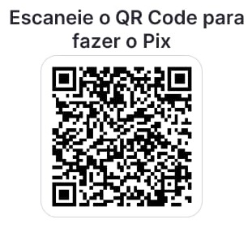

📸 OCR Offline - App de Teste
Aplicação web para reconhecimento óptico de caracteres (OCR) totalmente offline usando Tesseract.js

📋 Sobre o Projeto
Este é um app de teste para demonstrar o funcionamento do OCR offline usando Tesseract.js. O aplicativo permite extrair texto de imagens de produtos e criar
uma lista de compras simples, tudo processado localmente no navegador.

🎯 Funcionalidades
📷 Capturar imagem (câmera ou galeria)

🔍 Extrair texto com OCR offline
📝 Preencher automaticamente nome, preço e quantidade
📋 Listar produtos com total calculado
💰 Calcular total geral da compra
🔒 100% offline (após primeiro download)

🚀 Tecnologias
Tecnologia	Descrição
HTML5	Estrutura da página
CSS3	Design responsivo (mobile-first)
JavaScript (ES6+)	Lógica do aplicativo
Tesseract.js v5	Motor OCR (reconhecimento de texto)
IndexedDB	Cache dos modelos de idioma
LocalStorage	Armazenamento local

Apenas um arquivo: appoffline.html   # Aplicativo completo (single-file)

Alterar idioma:
// 🔥 CARREGA O IDIOMA
await worker.loadLanguage('por');  // Português

// Opções:
// 'por'  → Português
// 'eng'  → Inglês
// 'spa'  → Espanhol
// 'fra'  → Francês
// 'deu'  → Alemão
// 'ita'  → Italiano

Na primeira execução é necessario acesso a internet para baixar o modelo. Depois disso funcionara offline.

1. Usuário seleciona imagem
        ↓
2. Tesseract.js carrega modelo do cache
        ↓
3. Processa a imagem (OCR)
        ↓
4. Extrai texto bruto
        ↓
5. Algoritmo identifica:
   - Nome do produto
   - Preço (R$ 10,50)
   - Quantidade (500ml, 2kg)
        ↓
6. Preenche campos automaticamente
        ↓
7. Usuário confirma e adiciona

💰 Apoie o Projeto
Se este projeto te ajudou, considere fazer uma doação para apoiar o desenvolvimento contínuo! Sua contribuição ajuda a manter o projeto atualizado com as mudanças da ANTT, corrigir bugs e desenvolver novas funcionalidades.

🇧🇷 QR Code Pix

  

Chave Pix: gmscomputadores@bol.com.br
